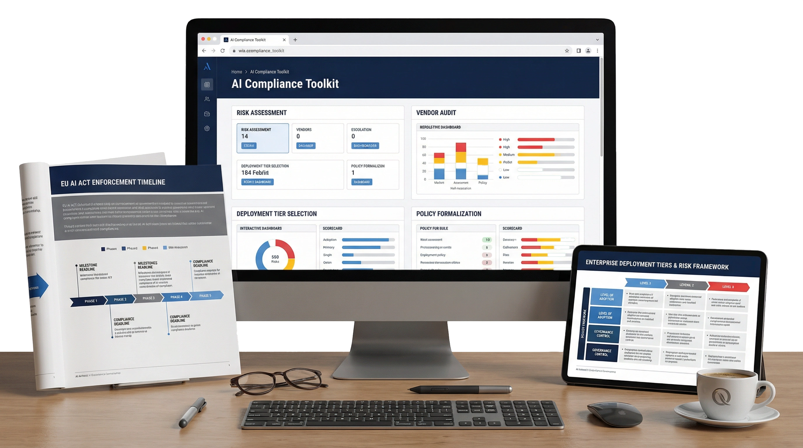
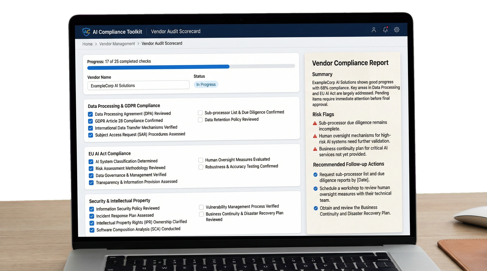
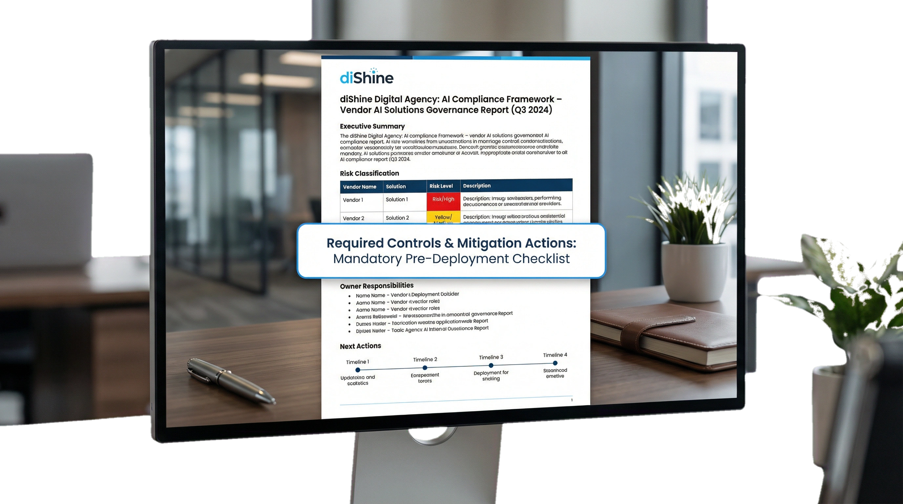
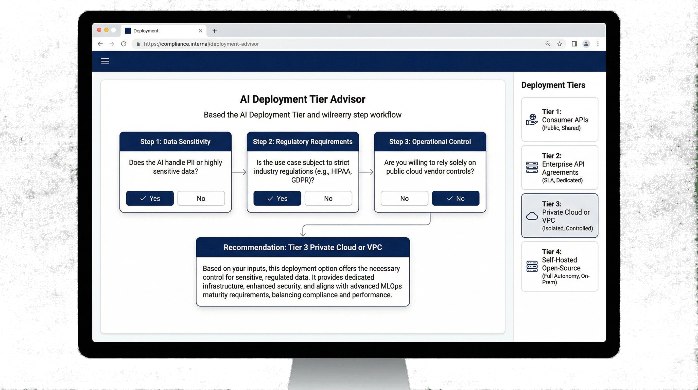
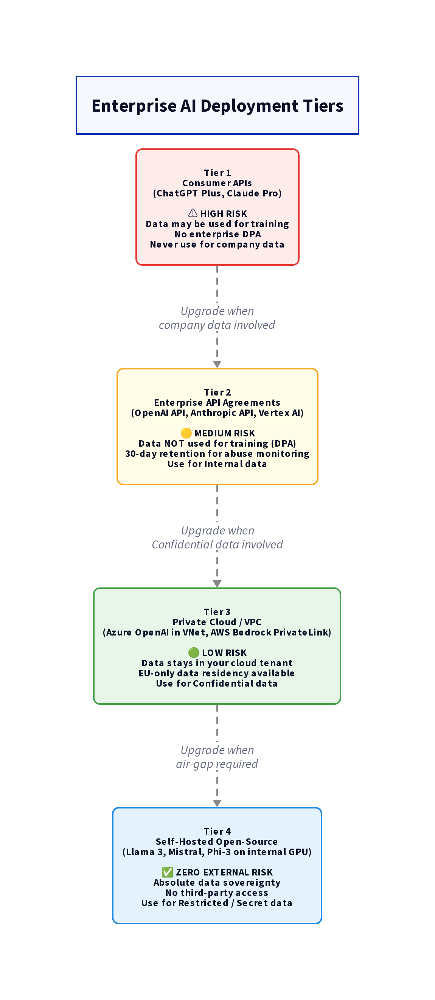
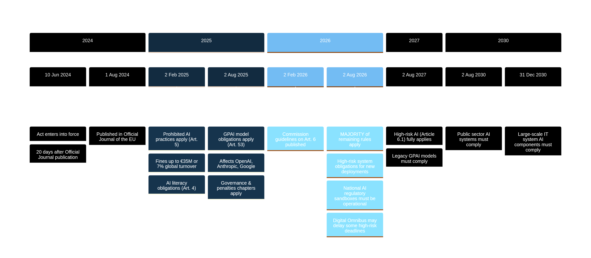

# AI Compliance Framework for Enterprises: a practical Framework for adopting AI responsibly in corporate environments, balancing innovation with regulatory compliance.

  

Built by [diShine Digital Agency](https://dishine.it) in collaboration with legal advisors, this repository provides templates, decision matrices, and audit checklists for navigating the **EU AI Act**, **GDPR**, and corporate **Intellectual Property (IP)** protection.

*Updated: April 2026 — Version 2.0.0*

  
  

  

---

## The Problem: Shadow AI and Regulatory Uncertainty

Enterprise AI adoption faces two systemic risks:
1. **Shadow AI:** Employees using consumer-grade AI tools (ChatGPT, Claude, Gemini) without IT oversight, leading to IP leaks (e.g., the 2023 Samsung source code incident) and potential GDPR violations. Gartner estimates that by 2026, 80% of employees will use generative AI for work without company approval.
2. **Regulatory Uncertainty:** Legal and compliance teams blocking AI initiatives due to the EU AI Act (fines up to €35M or 7% of global turnover) and unclear enforcement timelines.

This framework provides the operational guardrails to deploy AI while maintaining data sovereignty and regulatory compliance.

## What's Inside

This repository contains ready-to-use Markdown templates and strategic guidelines. **New to the framework? Start with the [Step-by-Step User Guide](guides/how-to-use-this-framework.md)** — it explains the correct sequence for deploying these tools, who should own each step, and why each step matters.

### 0. 📖 [Step-by-Step User Guide](guides/how-to-use-this-framework.md)
A comprehensive guide that walks any team through the full AI compliance journey across four phases: Assess & Contain, Audit & Procure, Architect & Deploy, and Monitor & Respond. Each step references the correct template, names the responsible owner (CISO, DPO, CTO, etc.), and explains the regulatory and business rationale behind the action.

### 1. 📄 [Acceptable AI Use Policy Template](templates/acceptable-use-policy.md)
A customizable corporate policy that defines exactly what employees can and cannot do with AI tools. It categorizes data (Public, Internal, Confidential, Restricted) and maps it to approved AI tiers, explicitly addressing the risks of Shadow AI.

### 2. 🛡️ [AI Vendor Audit Checklist (GDPR & EU AI Act)](templates/vendor-audit-checklist.md)
A rigorous 25-point checklist for evaluating third-party AI vendors. It goes beyond standard security questionnaires to address specific AI risks: model training data provenance, Article 22 (automated decision-making) implications, and EU AI Act GPAI obligations.

### 3. 🏗️ [Enterprise AI Deployment Decision Matrix](templates/deployment-decision-matrix.md)
A strategic framework for CTOs and IT Directors to choose the right architectural tier for any AI project:
- **Tier 1:** Consumer APIs (High Risk)
- **Tier 2:** Enterprise API Agreements (Medium Risk)
- **Tier 3:** Private Cloud / VPC Deployment (Low Risk)
- **Tier 4:** Self-Hosted Open-Source Models (Zero External Risk)

### 4. 🔒 [Prompt Engineering IP Protection Guidelines](templates/prompt-ip-guidelines.md)
Technical and legal guidelines on preventing Intellectual Property leakage through AI prompts. Covers redaction techniques, the legal definition of trade secret disclosure via LLMs, and the critical difference between system prompts and user prompts.

### 5. 🧮 [Shadow AI Risk Calculator](templates/shadow-ai-risk-calculator.md)
A scored self-assessment tool (100 points across 4 sections) that quantifies your organization's current Shadow AI exposure. The result maps to a risk band (Managed / Moderate / Elevated / Critical) with a concrete remediation roadmap. Based on IBM's 2024 Cost of a Data Breach Report and Gartner's Shadow AI research.

### 6. 📊 [Data Protection Impact Assessment (DPIA) for AI](templates/dpia-ai-template.md)
A specialized DPIA template designed specifically for AI systems, addressing algorithmic bias, opacity, and GDPR Article 22 (Automated Decision-Making) requirements.

### 7. 🌐 [ISO/IEC 42001:2023 Alignment Guide](templates/iso42001-alignment-guide.md)
A practical 12-month roadmap for mid-market enterprises to implement an Artificial Intelligence Management System (AIMS) and prepare for ISO 42001 certification.

### 8. 🏢 Sector-Specific Addenda
Industry-specific regulatory mapping and risk classifications:
*   [Financial Services Addendum](templates/sector-addendum-finance.md) (DORA, MiFID II, Credit Scoring)
*   [Technology Sector Addendum](templates/sector-addendum-tech.md) (Provider vs. Deployer, NIS2, CRA)
*   [Beauty & Cosmetics Addendum](templates/sector-addendum-beauty.md) (MDR, Biometric Categorization, EU Cosmetics Regulation)
*   [Healthcare & Life Sciences Addendum](templates/sector-addendum-healthcare.md) (MDR/IVDR, CDSS, GDPR Art. 9 Health Data)
*   [Human Resources & Employment Addendum](templates/sector-addendum-hr.md) (Annex III.4, Art. 22 Automated Decisions, Emotion Recognition Prohibition)

### 9. 📋 [DPIA Example Library](templates/dpia-example-library.md)
Three pre-filled, pragmatic Data Protection Impact Assessment (DPIA) examples for the most common enterprise AI deployments, combining GDPR Article 35 and EU AI Act Article 30 (Fundamental Rights Impact Assessment) requirements:
*   **AI Recruitment Screening Tool** — algorithmic bias risks, Art. 22 obligations, mandatory human oversight;
*   **AI Customer Service Chatbot with Sentiment Analysis** — special category data inference, DLP masking, Art. 50 transparency;
*   **AI Employee Performance Monitoring** — profiling risks, Works Council consultation, mandatory prior SA consultation trigger.

### 10. 🚨 [AI Incident Response Playbook](templates/ai-incident-response-playbook.md)
A structured, forensic AI incident response framework aligned with EU AI Act Article 73 (Serious Incident Reporting), GDPR Articles 33/34, and the NIST AI RMF 1.0. Covers the full 6-phase response lifecycle, a P1–P4 severity taxonomy, regulatory notification timelines (15-day AI Act window, 72-hour GDPR window), and specific response tactics for prompt injection, model inversion, and algorithmic bias discovery.

### 11. 🤖 [GPAI Model Governance Checklist](templates/gpai-model-governance-checklist.md)
A practical compliance checklist for organizations that develop, fine-tune, or deploy General Purpose AI (GPAI) models under EU AI Act Articles 53–55. Covers the 10^25 FLOPs systemic risk threshold, Article 53 baseline obligations (technical documentation, Annex XI/XII, copyright policy, training data summary), Article 55 systemic risk obligations (adversarial red-teaming, AI Office incident reporting), deployer due diligence requirements, and the GPAI Code of Practice (published July 2025) as a safe-harbor compliance path.

### 12. ⚖️ [Algorithmic Bias Audit Methodology Guide](guides/algorithmic-bias-audit-methodology.md)
A rigorous, step-by-step methodology for conducting an algorithmic fairness audit, grounded in statistical theory and current regulatory requirements. Covers the four core statistical fairness criteria (Demographic Parity, Equal Opportunity, Equalized Odds, Predictive Parity) with exact mathematical definitions; the Chouldechova (2017) and Kleinberg et al. (2016) impossibility theorems and their practical audit implications; a 4-phase audit methodology (pre-audit scoping, data bias audit, model bias audit, intersectional audit); bias mitigation strategies (pre-processing, in-processing, post-processing) with their accuracy-fairness trade-offs; and EU AI Act Article 10 compliance documentation requirements.

### 13. 🛠️ [Interactive Compliance Toolkit](tools/compliance-toolkit.html)
A standalone, client-side web application that brings three key framework components to life as interactive tools:
*   **Shadow AI Risk Calculator** — Automated scoring across four dimensions (Organizational Awareness, Technical Controls, Data Governance, Incident History) with risk band determination and remediation recommendations.
*   **Vendor Compliance Scorecard** — Interactive 25-item checklist tracking progress against EU AI Act and GDPR vendor requirements, with compliance grading and gap reporting.
*   **Deployment Tier Advisor** — A guided 3-question decision tree that recommends the appropriate deployment architecture (Tier 2–4) based on data sensitivity, infrastructure capability, and regulatory requirements.

No data is transmitted externally — the toolkit runs entirely in the browser.

## Visual Reference

### Enterprise AI Deployment Tiers

### EU AI Act Enforcement Timeline

---

## How to Use This Framework

For a full walkthrough of every step, see the **[Step-by-Step User Guide](guides/how-to-use-this-framework.md)**. It covers the correct sequence, the responsible owner for each action, and the regulatory rationale behind every tool in this repository.

In brief: start with the [Interactive Compliance Toolkit](tools/compliance-toolkit.html) or the [Shadow AI Risk Calculator](templates/shadow-ai-risk-calculator.md) to quantify your current exposure, then establish the rules with the [Acceptable AI Use Policy](templates/acceptable-use-policy.md), audit your existing vendors with the [Vendor Audit Checklist](templates/vendor-audit-checklist.md), and use the [Deployment Decision Matrix](templates/deployment-decision-matrix.md) to govern every new AI initiative. The sector-specific addenda, DPIA templates, and audit methodology guides apply when you are deploying high-risk AI systems.

## Contributing

See [CONTRIBUTING.md](CONTRIBUTING.md) for guidelines on how to contribute to this framework.

## Security

See [SECURITY.md](SECURITY.md) for the security policy and vulnerability reporting process.

## About diShine

[diShine](https://dishine.it) is a digital agency specializing in AI strategy, compliance engineering, and data-sovereign infrastructure for B2B enterprises. This framework was developed in collaboration with legal advisors to address real compliance challenges our clients face.

For consulting or implementation support, [contact us](https://dishine.it/contacts/).

## License

This project is licensed under the MIT License - see the [LICENSE](LICENSE) file for details. You are free to use, modify, and distribute these templates within your organization.
